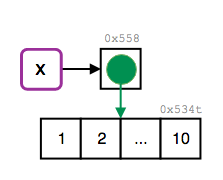
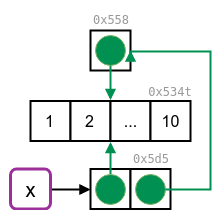
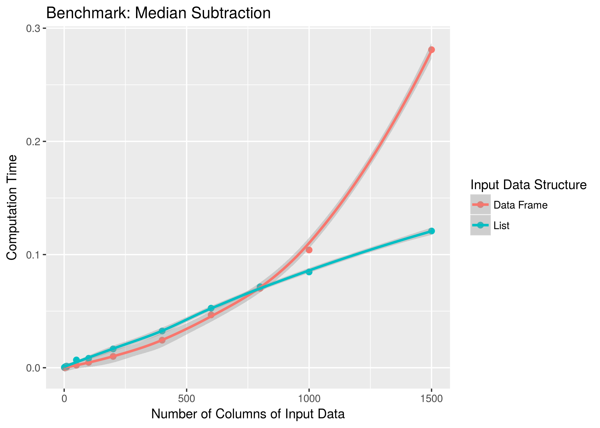

```{r, include=FALSE}
source("common.R")
```

# Names and values
## Prerequisites {-}

We use the development version of lobstr to answer questions regarding the internal representation of R objects.

```{r setup}
library(lobstr) 
```

## Binding basics

1. __<span style="color:red">Q</span>__: Explain the relationship between `a`, `b`, `c` and `d` in the following code:

    ```{r}
    a <- 1:10
    b <- a
    c <- b
    d <- 1:10
    ```
    
   __<span style="color:green">A</span>__: `a`, `b`, `c` point to the same object (with the same address in memory). This object has the value `1:10`. `d` points to a different object with the same value.

    ```{r}
    list_of_names <- list(a, b, c, d)
    obj_addrs(list_of_names)
    ```

2. __<span style="color:red">Q</span>__: The following code accesses the mean function in multiple ways. Do they all point to the same underlying function object? Verify with `lobstr::obj_addr()`.
    
    ```{r, eval = FALSE}
    mean
    base::mean
    get("mean")
    evalq(mean)
    match.fun("mean")
    ```
    
   __<span style="color:green">A</span>__: Yes, they point to the same object. We confirm this by inspecting the address of the underlying function object.
       
    ```{r}
    mean_functions <- list(mean,
                           base::mean,
                           get("mean"),
                           evalq(mean),
                           match.fun("mean"))
    
    unique(obj_addrs(mean_functions))
    ```
    
3. __<span style="color:red">Q</span>__: By default, base R data import functions, like `read.csv()`, will automatically convert non-syntactic names to syntactic names. Why might this be problematic? What option allows you to suppress this behaviour?
    
   __<span style="color:green">A</span>__: When automatic and implicit (name) conversion occurs, the prediction of a scripts output will be more difficult. For example when R is used non-interactively and some data is read, transformed and written, than the output may not contain the same names as the original data source. This behaviour may introduce problems in downstream analysis. To avoid automatic name conversion set `check.names=FALSE`.
   
   <!-- I think the key point is that column names are often data, and the make.names() transformation is non-invertible, so the default behaviour corrupts data -->
    
4. __<span style="color:red">Q</span>__: What rules does `make.names()` use to convert non-syntactic names into syntactic names?
    
   __<span style="color:green">A</span>__: A valid name starts with a letter or a dot (which must not be followed by a number). It also consists of letters, numbers, dots and underscores only (`"_"` are allowed since R version 1.9.0).
   
   Three main mechanisms ensure syntactically valid names (see `?make.names`):
   - The variable name will be prepended by an `X` when names do not start with a letter or start with a dot followed by a number
    
      ```{r}
      make.names("")
      make.names(".1")
      ```
    
   - (additionally) non-valid characters are replaced by a dot
    
      ```{r}
      make.names("@")          # prepending + . replacement 
      make.names("  ")         # prepending + .. replacement
      make.names("non-valid")  # . replacement
      ```
    
   - reserved R keywords (see `?reserved`) are suffixed by a dot
    
      ```{r}
      make.names("if")
      ```
    
   Interestingly, some of these transformations are influenced by the current locale (from `?make.names`):

   > The definition of a letter depends on the current locale, but only ASCII digits are considered to be digits.

5. __<span style="color:red">Q</span>__: I slightly simplified the rules that govern syntactic names. Why is `.123e1` not a syntactic name? Read `?make.names` for the full details.
    
   __<span style="color:green">A</span>__: `.123e1` is not a syntactic name, because it starts with one dot which is followed by a number. This makes it a double, `1.23`.

## Copy-on-modify

1. __<span style="color:red">Q</span>__: Why is `tracemem(1:10)` not useful?

   __<span style="color:green">A</span>__: 
   When `1:10` is called an object with an address in memory is created, but it is not bound to a name. Therefore the object cannot be called or manipulated from R. As no copies will be made, it is not useful to track the object for copying.
   
    ```{r}
    obj_addr(1:10)  # the object exists, but has no name
    ```
   
2. __<span style="color:red">Q</span>__: Explain why `tracemem()` shows two copies when you run this code. Hint: carefully look at the difference between this code and the code show earlier in the section.
     
    ```{r, results = FALSE}
    x <- c(1L, 2L, 3L)
    tracemem(x)
    
    x[[3]] <- 4
    ```
    
   __<span style="color:green">A</span>__: Initially the vector `x` has integer type. The replacement call assigns a double to the third element of `x`, which triggers copy-on-modify.

    ```{r, eval=FALSE}
    # two copies
    x <- 1:3
    tracemem(x)
    #> <0x66a4a70>
    
    x[[3]] <- 4
    #> tracemem[0x55eec7b3af38 -> 0x55eec774cc18]: 
    ```
    
    <!-- I only see one copy when I run this in the console. Are you sure you didn't run inside RStudio?  -->
    
   We can avoid the copy by sub-assigning an integer instead of a double:
    
    ```{r, eval=FALSE}
    # the same as 
    x <- 1:3
    tracemem(x)
    #> <0x55eec6940ae0>
    
    x[[3]] <- 4L
    #> tracemem[0x55eec7021e10 -> 0x55eecb99e788]: 
    ```

   <!-- code-chunks above were hard-coded to fix knitr output. -->

3. __<span style="color:red">Q</span>__: Sketch out the relationship between the following objects:

    ```{r}
    a <- 1:10
    b <- list(a, a)
    c <- list(b, a, 1:10)
    ```
    
   __<span style="color:green">A</span>__: `a` contains a reference to an address with the value `1:10`. `b` contains a list of two references to the same address as `a`. `c` contains a list of `b` (containing two references to `a`), `a` (containing the same reference again) and a reference pointing to a different address containing the same value (`1:10`).
   
   <!-- could you insert an actual drawing here? -->

    ```{r, eval = FALSE}
    ref(c)
    #> █ [1:0x55eec93cbdd8] <list>    # c
    #> ├─█ [2:0x55eecb8246e8] <list>  # - b
    #> │ ├─[3:0x55eec7df4e98] <int>   # -- a
    #> │ └─[3:0x55eec7df4e98]         # -- a
    #> ├─[3:0x55eec7df4e98]           # - a
    #> └─[4:0x55eec7aa6968] <int>     # - 1:10
    ```

4. __<span style="color:red">Q</span>__: What happens when you run this code:

    ```{r}
    x <- list(1:10)
    x[[2]] <- x
    ```
    
    <!-- I think I actually meant to say `x[[2]] <- x[[1]]` to make the problem slightly less complicated -->
    
   Draw a picture.

   __<span style="color:green">A</span>__: The initial reference tree of `x` shows, that the name `x` binds to a list object. This object contains a reference to the integer vector `1:10`.

    ```{r, eval=FALSE}
    x <- list(1:10)
    ref(x)
    #> █ [1:0x55853b74ff40] <list> 
    #> └─[2:0x534t3abffad8] <int> 
    ```

    ```{r, echo = FALSE}
    
    ```

   When `x` is assigned to an element of itself copy-on-modify takes place and the list is copied to a new address in memory.

    ```{r, eval=FALSE}
    tracemem(x)
    x[[2]] <- x
    #> tracemem[0x55853b74ff40 -> 0x5d553bacdcd8]:
    ```

   The list object previously bound to `x` is now referenced in the newly created list object. It is no longer bound to a name. The integer vector is referenced twice.

    ```{r, eval=FALSE}
    ref(x)
    #> █ [1:0x5d553bacdcd8] <list> 
    #> ├─[2:0x534t3abffad8] <int> 
    #> └─█ [3:0x55853b74ff40] <list> 
    #>   └─[2:0x534t3abffad8] 
    ```

    ```{r, echo = FALSE}
    
    ```
    
    <!-- The image size doesn't look right -->    
    <!-- The arrow pointing to 0x558 is pointing upwards instead of leftwards -->

## Object size

1. __<span style="color:red">Q</span>__: In the following example, why are `object.size(y)` and `obj_size(y)` so radically different? Consult the documentation of `object.size()`.

    ```{r}
    y <- rep(list(runif(1e4)), 100)
    
    object.size(y)
    obj_size(y)
    ```
    
   __<span style="color:green">A</span>__: `object.size()` doesn't account for shared elements within lists. Therefore, the results differ by a factor of ~ 100.

2. __<span style="color:red">Q</span>__: Take the following list. Why is its size somewhat misleading?

    ```{r, return = FALSE}
    x <- list(mean, sd, var)
    # obj_size(x)
    #> 16,928 B
    ```
    __<span style="color:green">A</span>__: It is somewhat misleading, because all three functions are built-in to R as part of the base and stats packages and hence always available. 
    
   From the following calculations we can see that this applies to about 2400 objects usually loaded by default.
   
   <!-- I couldn't get the forward reference here to work. I think you'd be better off rewriting the code block to be more self-explanatory -->
  
   <!-- Can you please the tidyverse style guide? -->
  
    ```{r}
    base_pkgs <- c(
      "package:stats", "package:graphics", "package:grDevices",
      "package:utils", "package:datasets", "package:methods",
      "package:base"
    )
    base_envs <- lapply(base_pkgs, as.environment)
    names(base_envs) <- base_pkgs
    base_objs <- lapply(base_envs, function(x) mget(ls(x), x))

    sum(lengths(base_objs))
    
    # Show sizes in MB
    base_sizes <- vapply(base_objs, obj_size, double(1)) / 1024^2
    
    base_sizes
    sum(base_sizes)
    
    # Check if we've over-counted
    as.numeric(obj_size(!!!base_objs)) / 1024^2
    ```

3. __<span style="color:red">Q</span>__: Predict the output of the following code:

    ```{r, eval = FALSE}
    x <- runif(1e6)
    obj_size(x)
    #> 8,000,048 B
    
    y <- list(x, x)
    obj_size(y)
    obj_size(x, y)
    
    y[[1]][[1]] <- 10
    obj_size(y)
    obj_size(x, y)
    
    y[[2]][[1]] <- 10
    obj_size(y)
    obj_size(x, y)
    ```
    
    <!-- I think I accidentally made this too hard too - the important thing is the size of y, not of x -->
    
   __<span style="color:green">A</span>__: In R (on most platforms) a length-0
  vector has 48 bytes of overhead:

    ```{r}
    obj_size(list())
    obj_size(double())
    obj_size(character())
    ```
   
   A single double takes up an additional 8 bytes of memory:
   
    ```{r}
    obj_size(double(1))
    obj_size(double(2))
    ```
   
   So 1 million double should take up 8,000,048 bytes: 

    ```{r}
    obj_size(double(1e6))
    ```
    
    (If you look carefully at the amount of memory occupied by short vectors, you'll notice that the pattern is actually more complicated. This is to do with how R allocates memory, and is not that important. If you want to know the full details, they're discussed in the 1st edition of Advanced R: http://adv-r.had.co.nz/memory.html#object-size)

   In `y <- list(x, x)` both list elements of `y` contain references to the same memory address, so no additional memory is required for the second list element. The list itself requires 64 bytes, 48 byte for an empty list and 8 byte for each element (`obj_size(vector("list", 2))`). This let's us predict 8000048 B + 64 B = 8000112 B:
   
    ```{r}
    y <- list(x, x) 
    obj_size(y)
    ```
   
   The list `y` already contains references to `x`, so no extra memory is needed for `x` and the amount of required memory stays the same.
   
    ```{r}
    obj_size(x, y) 
    ref(x, y)
    ```
    
   When we modify the first element of `y[[1]]` copy-on-modify occurs and the object will have the same size (8000040 bytes) and a new address in memory. So `y`'s elements don't share references anymore. Because of this their object sizes add up to the sum of of the two different vectors and the length-2 list: 8000048 B + 8000048 B + 64 B = 16000160 B (16 MB).

    ```{r}
    y[[1]][[1]] <- 10
    obj_size(y) 
    ```
    
   The second element of `y` still references to the same address as `x`, so the combined size of `x` and `y` is the same as `y`:
   
    ```{r}
    obj_size(x, y) 
    ref(x, y)
    ```
    
   When we modify the second element of `y`, this element will also point to a new memory address. This doesn´t affect the size of the list:
   
    ```{r}
    y[[2]][[1]] <- 10
    obj_size(y) 
    ```
   
   However, as `y` doesn't share references with `x` anymore, the memory usage of the combined objects increases:
   
    ```{r}
    ref(x, y)
    obj_size(x, y) 
    ```

## Modify-in-place

1. __<span style="color:red">Q</span>__: Explain why the following code doesn't create a circular list.

    ```{r}
    x <- list()
    x[[1]] <- x
    ```
    
   __<span style="color:orange">A</span>__: In this situation Copy-on-modify prevents the creation of a circular list. Let's step through the details as follows:
   
   <!-- can't use tracemem with knitr -->
   
    ```{r}
    x <- list()      # creates initial object
    obj_addr(x)
    
    tracemem(x)
    x[[1]] <- x  # Copy-on-modify triggers new copy
    
    obj_addr(x)       # copied object has new memory address
    obj_addr(x[[1]])  # list element contains old memory adress
    ```

2. __<span style="color:red">Q</span>__: Wrap the two methods for subtracting medians into two functions, then use the bench package to carefully compare their speeds. How does performance change as the number of columns increase?
    
   __<span style="color:green">A</span>__: First, let's define a function to create some random data and a function to subtract the median from each column.

    ```{r}
    create_random_df <- function(nrow, ncol) {
      random_matrix <- matrix(runif(nrow * ncol), nrow = nrow)
      as.data.frame(random_matrix)
    }
    
    subtract_medians <- function(x, medians){
      for (i in seq_along(medians)) {
        x[[i]] <- x[[i]] - medians[[i]]
      }
      x
    }
    
    subtract_medians_l <- function(x, medians){
      x <- as.list(x)
      x <- subtract_medians(x, medians)
      as.data.frame(x)
    }
    ```

    <!-- Need to update text and code to use subtract_medians_2 -->
  
   We can then profile the performance, by benchmarking `subtact_medians()` on data frame- and list-input for a specified number of columns. The functions should both input and output a data frame, so one is going to do a bit more work.

    ```{r}
    compare_speed <- function(ncol){
      df_input   <- create_random_df(nrow = 1e4, ncol = ncol)
      medians <- vapply(df_input, median, numeric(1))
      
      bench::mark(`Data Frame` = subtract_medians(df_input,   medians),
                  List = as.data.frame(subtract_medians(as.list(df_input), medians)))
    }
    ```

   Then bench package allows us to run our benchmark across a grid of parameters easily. We will use it to slowly increase the number of columns containing random data.

    ```{r, warning=FALSE, message=FALSE, eval=FALSE}
    results <- bench::press(
      ncol = c(1, 5, 10, 50, 100, 200, 400, 600, 800, 1000, 1500),
      compare_speed(ncol)
    )
    
    library(ggplot2)
    ggplot(results, aes(ncol, median, col = expression)) +
      geom_point(size = 2) + 
      geom_smooth() +
      labs(x = "Number of Columns of Input Data", y = "Computation Time",
           color = "Input Data Structure",
           title = "Benchmark: Median Subtraction")
    ```

    ```{r, echo = FALSE}
    
    ```

   When working directly with the data frame, the execution time grows quadratically with the number of columns in the input data. This is because (e.g.) the first column must be copied `n` times, the second column `n-1` times, and so on. When working with a list, the execution time increases only linearly.
   
   Obviously in the long run, linear growth creates shorter run-times, but there is some cost to this strategy - we have to convert between data structures with `as.list()` and `as.data.frame()`. This means that the improved approach doesn't pay off until we get to a data frame that's ~800 columns wide.

3. __<span style="color:red">Q</span>__: What happens if you attempt to use `tracemem()` on an environment?

   __<span style="color:green">A</span>__: `tracemem()` cannot be used to mark and trace environments.

    ```{r, error=TRUE}
    x <- new.env()
    tracemem(x)
    ```

   The error occurs because "it is not useful to trace NULL, environments, promises, weak references, or external pointer objects, as these are not duplicated" (see `?tracemem`). Environments are always modified in place.
