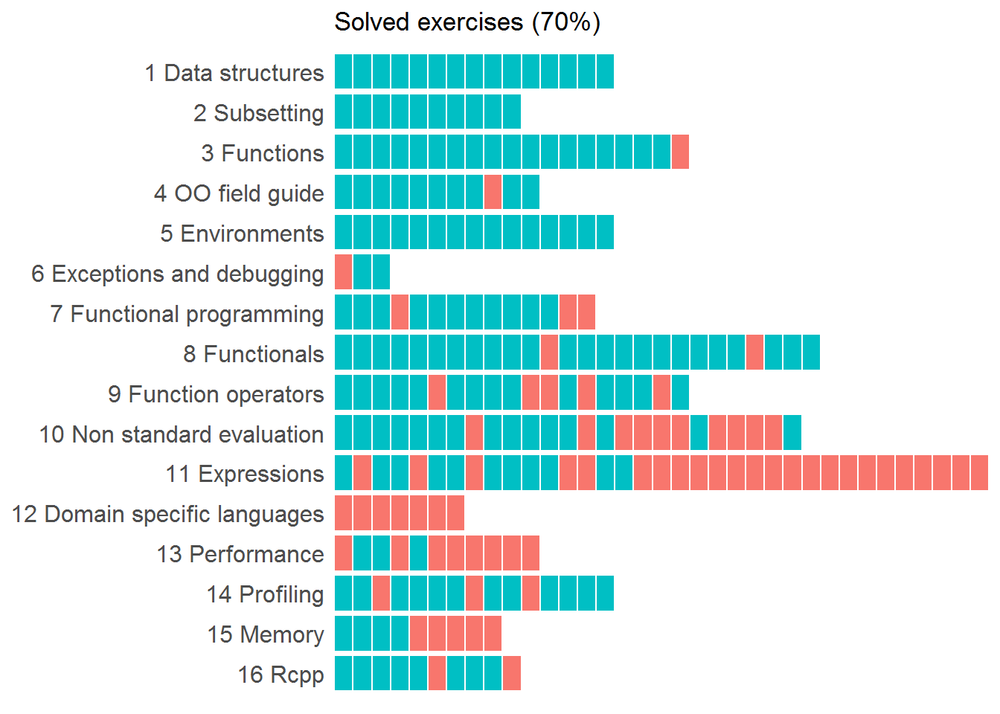

--- 
title: "Advanced R Solutions"
author: "Malte Grosser & Henning Bumann"
date: "2017-04-10"
knit: "bookdown::render_book"
site: bookdown::bookdown_site
output:
  bookdown::gitbook:
    includes:
      in_header: html_header.html
    config:
      toc:
          collapse: section
          scroll_highlight: yes
          before: null
          after: null
      edit: https://github.com/Tazinho/Advanced-R-Solutions/edit/master/%s
documentclass: book
bibliography: [packages.bib]
biblio-style: apalike
link-citations: yes
github-repo: Tazinho/Advanced-R-Solutions
before_chapter_script: ["before_chapter_script_1.R"]
description: "Solutions to the exercises in Hadley Wickham's book Advanced R."
cover-image: images/advrs_cover.png
---

# Prerequisites {-}

This book aims to contribute solutions to Hadley Wickham's book [Advanced R](http://adv-r.had.co.nz/).
It is planned to finish until end of 2016. The code can be found on [github](https://github.com/Tazinho/Advanced-R-Solutions.git).

The date of the exercise versions in Hadley's book is January 25th 2017.

 This work by Malte Grosser and Henning Bumann is licensed under a <a rel="license" href="http://creativecommons.org/licenses/by-nc-sa/4.0/">Creative Commons Attribution-NonCommercial-ShareAlike 4.0 International License</a>
