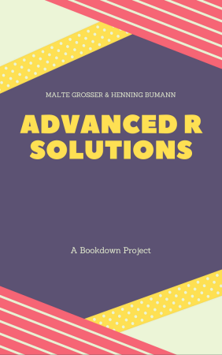

`r if (knitr::is_latex_output()) '<!--'` 

# Welcome {-}

```{r global_options, include = FALSE}
knitr::opts_chunk$set(collapse = TRUE)  
```



This book offers solutions to the exercises from Hadley Wickham's book [Advanced R](https://adv-r.hadley.nz/) (Edition 2). It is work in progress and under active development. The 2nd edition of Advanced R has been published and we are currently working towards completion.

The solutions to the first edition of Advanced R can currently be found at https://advanced-r-solutions-ed1.netlify.com.

The code for this book can be found on [GitHub](https://github.com/Tazinho/Advanced-R-Solutions.git). Your PRs and suggestions are very welcome. 

## License {-}

<a rel="license" href="http://creativecommons.org/licenses/by-nc-sa/4.0/"></a><br />This work by Malte Grosser and Henning Bumann is licensed under a <a rel="license" href="http://creativecommons.org/licenses/by-nc-sa/4.0/">Creative Commons Attribution-NonCommercial-ShareAlike 4.0 International License</a>

## Acknowledgements {-}

We would also like to thank everybody else who contributed to this project by fixing typos, grammar or revising exercises:

```{r, echo= FALSE, results= 'asis', message = FALSE}
library(dplyr)
contributors <- read.csv("contributors.csv", encoding = "UTF-8")

contributors <- contributors %>% 
  filter(!login %in% c("hadley", "henningsway", "Tazinho")) %>% 
  mutate(
    login = paste0("\\@", login),
    desc = ifelse(is.na(name), login, paste0(name, " (", login, ")"))
  ) %>% 
  arrange(login)

cat(paste0(contributors$desc, collapse = ", "))
cat(".\n")
```

## Current Progress {-}

```{r, echo = FALSE, cache = FALSE, warning = FALSE, message=FALSE, fig.width = 8, fig.height=10}
library(tibble)
library(dplyr)
library(purrr)
library(tidyr)
library(forcats)
library(ggplot2)

# import from file --------------------------------------------------------
df_long <- read.csv2("progress_data.csv", stringsAsFactors = FALSE, 
                      header = TRUE) %>% 
  as_tibble() %>% 
  modify_at("status", factor,
            levels = c("open", "started", "solved", "reviewed", "finalised")) %>% 
  tibble::rowid_to_column("id") %>% 
  separate(chapter, "nr", sep = " ", remove = FALSE, extra = "drop") %>% 
  mutate(nr = as.integer(nr), 
         chapter = factor(chapter),
         chapter = fct_reorder(chapter, nr, .desc = TRUE),
         part = case_when(nr < 9 ~ "Foundations",
                          nr < 12 ~ "FP",
                          nr < 17 ~ "OOP",
                          nr < 22 ~ "Metapr.",
                          TRUE    ~ "Techn."),
         part = factor(part, levels = c("Foundations", "FP", "OOP",
                                        "Metapr.", "Techn.")))

# Intermediate calculations
percent_solved <- mean(df_long$status %in% c("solved", "reviewed", "finalised"), na.rm = TRUE) * 100
percent_reviewed <- mean(df_long$status %in% c("reviewed", "finalised"), na.rm = TRUE) * 100

# Create Plot
plot_progress <- df_long %>% 
  ggplot(aes(x = chapter, fill = status, group = -id,
             subchapter = subchapter, exercise = exercise,
             credits = credits)) +
  coord_flip() +
  geom_bar(color = "white") +
  scale_y_continuous(expand = c(0, 0)) +
  theme_bw(base_size = 14) +
  theme(legend.position = "bottom",
        # legend.justification = c(0, 1),
        strip.background = element_rect(fill = "#EFEFEF"),
        strip.placement = "outside",
        axis.text.x = element_blank(),
        axis.text.y = element_text(),
        axis.title = element_blank(),
        axis.ticks = element_blank(),
        # plot.title = element_text(hjust = 2.5),
        panel.grid = element_blank(),
        panel.border = element_blank(),
        panel.background = element_blank()) +
  guides(color = FALSE,
         fill = guide_legend(nrow = 1)) +
  scale_fill_manual(values = c("#F99992", "#fdcc8a", "#bae4b3", "#74c476", "#238b45"),
                    drop = FALSE) +
  labs(title = paste0("Solved Exercises: ",
                     round(percent_solved, 1),
                     "% (2nd Edition)"),
       subtitle = paste0("Reviewed: ",
                     round(percent_reviewed, 1),
                     "%"),
       caption = paste0("(Open: ",
                         sum(df_long$status == "open"),
                         " | Started: ",
                         sum(df_long$status == "started"),
                         " | Solved: ",
                         sum(df_long$status %in% c("solved", "reviewed", "finalised")),
                         " | Reviewed: ",
                         sum(df_long$status %in% c("reviewed", "finalised")),
                         " | Finalised: ",
                         sum(df_long$status == "finalised"),
                        ")"),
       fill = "Status:")

# Create static plot (including facets for parts)
plot_progress + 
  facet_grid(part ~ ., scales = "free",
             space = "free", switch = "both")
```

```{r include = FALSE, eval = FALSE}
# automatically create a bib database for R packages
knitr::write_bib(c(.packages(), 'bookdown', 'knitr', 'rmarkdown'),
                 'packages.bib')
```

<!-- `r if (knitr::is_latex_output()) '-->'` -->
